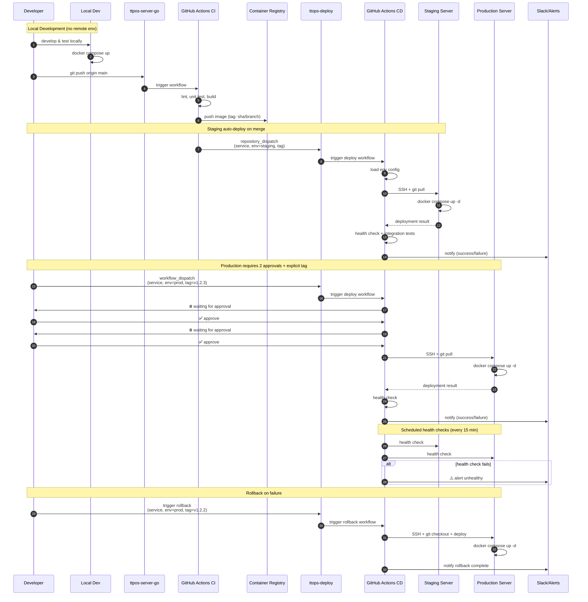
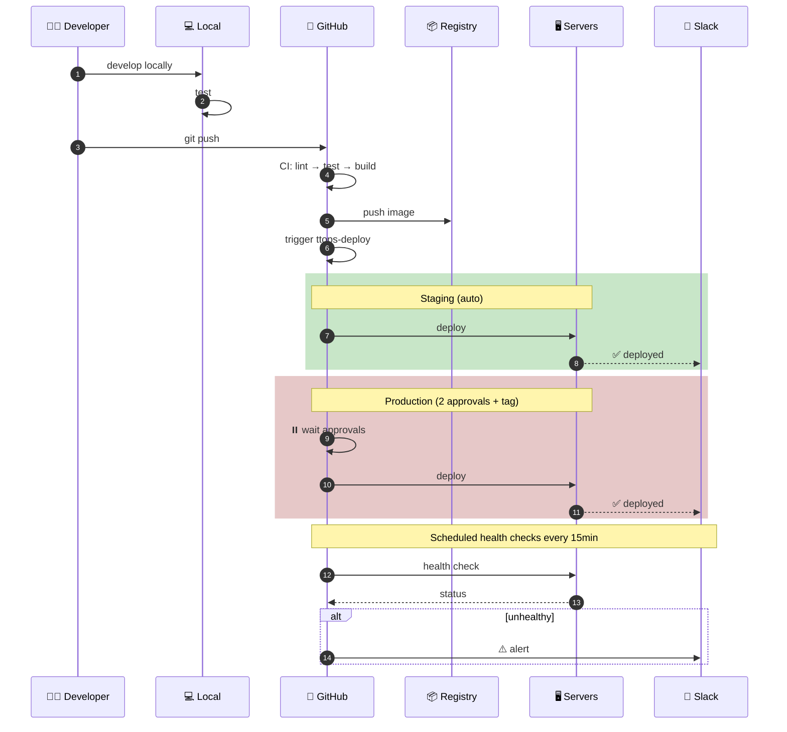
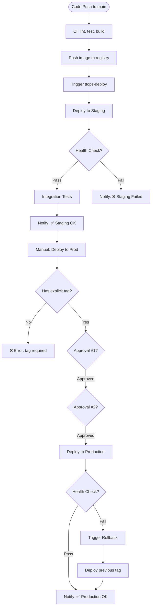
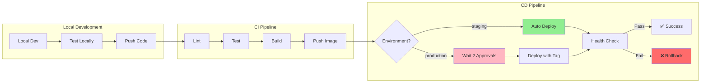
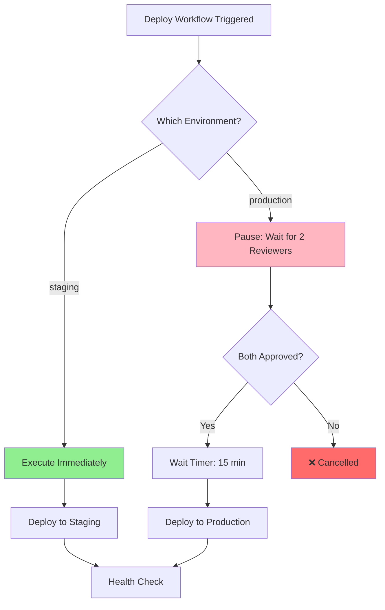

# TTPOS Deployment Repository Design

> A centralized deployment repository for managing TTPOS services across multiple environments using Docker Compose, Ansible, and GitOps-like workflows. Future migration path to Kubernetes with ArgoCD.

---

## Table of Contents

1. [Overview](#overview)
2. [Architecture](#architecture)
3. [Delivery Lifecycle](#delivery-lifecycle)
4. [Repository Structure](#repository-structure)
5. [Service Definitions](#service-definitions)
6. [Environment Configuration](#environment-configuration)
7. [Secrets Management](#secrets-management)
8. [Deployment Scripts](#deployment-scripts)
9. [GitHub Workflows](#github-workflows)
10. [Access Control](#access-control)
11. [Integration with Application Repos](#integration-with-application-repos)
12. [Rollback Strategy](#rollback-strategy)
13. [Setup Checklist](#setup-checklist)
14. [Future: Kubernetes Migration Path](#future-kubernetes-migration-path)

---

## Overview

### Goals

- Centralized deployment configuration for all TTPOS services
- Multi-environment support (staging, production)
- Local development (no remote dev environment needed)
- GitOps workflow with GitHub Actions
- Docker Compose based (K8s migration path preserved)
- Secure secrets management
- Easy rollback capability

### Separation of Concerns

```
┌─────────────────────────────────────────────────────────────────────────────┐
│                                                                              │
│   ttpos-server-go (this repo)              ttops-deploy (new repo)           │
│   ┌──────────────────────────────┐         ┌──────────────────────────────┐  │
│   │                              │         │                              │  │
│   │  Code + Tests                │         │  Configs + Deployment        │  │
│   │  CI: Build, Test, Package    │────────►│  CD: Deploy, Configure       │  │
│   │  Push Docker Images          │ trigger │  Environment Management      │  │
│   │                              │         │  Secrets Management          │  │
│   │                              │         │                              │  │
│   └──────────────────────────────┘         └──────────────────────────────┘  │
│                                                    │                         │
│                         ┌──────────────────────────┼───────────────────┐     │
│                         ▼                          ▼                   ▼     │
│                   ┌──────────┐              ┌──────────┐         ┌──────────┐│
│                   │   Dev    │              │ Staging  │         │   Prod   ││
│                   │  Server  │              │  Server  │         │ Servers  ││
│                   └──────────┘              └──────────┘         └──────────┘│
│                                                                              │
└─────────────────────────────────────────────────────────────────────────────┘
```

### Responsibility Matrix

| Repository | What | Why |
|------------|------|-----|
| **ttpos-server-go** | CI: lint, test, build, push images | Developers focus on code |
| **ttops-deploy** | CD: configure, deploy, monitor | Ops focus on environments |

---

## Architecture

### CD Machine + Ansible (GitOps-like Pattern)

This design uses a centralized CD machine running Ansible to simulate GitOps behavior for Docker Compose environments.

```
┌─────────────────────────────────────────────────────────────────────────────┐
│                    CD Machine + Ansible Architecture                         │
│                                                                              │
│   Git Repo (ttops-deploy)                                                    │
│         │                                                                    │
│         │ poll (1-5 min) / webhook                                           │
│         ▼                                                                    │
│   ┌─────────────┐                                                            │
│   │  CD Machine │  ← Runs Ansible playbooks                                  │
│   │  (always on)│  ← Detects drift & reconciles                              │
│   └─────────────┘                                                            │
│         │                                                                    │
│         │ Ansible (SSH)                                                      │
│         ▼                                                                    │
│   ┌──────────┐ ┌──────────┐ ┌──────────┐ ┌──────────┐                       │
│   │ Staging  │ │ Prod US  │ │ Prod EU  │ │ Prod APAC│  ...more regions      │
│   └──────────┘ └──────────┘ └──────────┘ └──────────┘                       │
│                                                                              │
└─────────────────────────────────────────────────────────────────────────────┘
```

### High-Level Flow

```
┌─────────────────────────────────────────────────────────────────────────────┐
│                          Deployment Flow                                     │
│                                                                              │
│  ┌──────┐    ┌─────────┐    ┌─────────┐    ┌────────────┐                   │
│  │ Local│    │  Build  │───►│ Staging │───►│ Production │                   │
│  │  Dev │───►│  (CI)   │    │ (auto)  │    │ (approval) │                   │
│  └──────┘    └─────────┘    └─────────┘    └────────────┘                   │
│                                   │               │                          │
│                                   │               │                          │
│                                   ▼               ▼                          │
│                              ┌─────────┐    ┌────────────┐                   │
│                              │ Tests   │    │ Integration│                   │
│                              │ Pass    │    │   Tests    │                   │
│                              └─────────┘    └────────────┘                   │
│                                                                              │
└─────────────────────────────────────────────────────────────────────────────┘
```

### CD Machine Responsibilities

| Responsibility | Description |
|----------------|-------------|
| Poll Git | Check for changes every 1-5 minutes |
| Detect changes | Compare current state with Git state |
| Run Ansible | Apply playbooks to reconcile state |
| Drift correction | Re-apply if manual changes detected |
| Report status | Send notifications (Slack, etc.) |

### Environment Promotion Rules

| Environment | Auto-deploy | Tag Strategy | Approval Required | Servers |
|-------------|-------------|--------------|-------------------|---------|
| **staging** | Yes (on merge) | `branch-name` / `sha` | None | 1-2 servers |
| **production** | No (manual) | `v1.2.3` (semver) | Multi-approval | Multiple regions |

---

## Delivery Lifecycle

### Full Delivery Sequence



### Simplified Overview



### Deployment Decision Flow



### Environment Promotion



---

## Repository Structure

```
ttops-deploy/
│
├── README.md
├── DESIGN.md                          # This file
├── Makefile                           # Quick commands
│
├── .github/
│   └── workflows/
│       ├── deploy.yml                 # Main deployment workflow
│       ├── rollback.yml               # Rollback workflow
│       └── health-check.yml           # Scheduled health checks
│
├── services/                          # Service definitions
│   │
│   ├── main/                          # ttpos-server-go/main
│   │   ├── compose.yml                # Base compose file
│   │   ├── compose.staging.yml        # Staging overrides
│   │   ├── compose.prod.yml           # Production overrides
│   │   └── healthcheck.sh             # Service health check
│   │
│   ├── bmp-erp/                       # ttpos-bmp/app/ttpos-erp
│   │   ├── compose.yml
│   │   ├── compose.staging.yml
│   │   ├── compose.prod.yml
│   │   └── healthcheck.sh
│   │
│   ├── bmp-takeout/                   # ttpos-bmp/app/ttpos-takeout
│   │   └── ... (same structure)
│   │
│   ├── bmp-message/                   # ttpos-bmp/app/ttpos-message
│   │   └── ... (same structure)
│   │
│   ├── bmp-websocket/                 # ttpos-bmp/app/ttpos-websocket
│   │   └── ... (same structure)
│   │
│   ├── nginx/                         # Shared gateway
│   │   ├── compose.yml
│   │   ├── compose.staging.yml
│   │   ├── compose.prod.yml
│   │   ├── config/
│   │   │   ├── nginx.conf
│   │   │   ├── staging.conf
│   │   │   └── prod.conf
│   │   └── healthcheck.sh
│   │
│   └── infrastructure/                # Shared infrastructure
│       ├── mysql/
│       │   ├── compose.yml
│       │   └── init/
│       │       └── init.sql
│       └── redis/
│           └── compose.yml
│
├── environments/                      # Environment configs
│   │
│   ├── staging/
│   │   ├── env
│   │   ├── inventory.yml
│   │   └── secrets/
│   │       └── .sops.yaml
│   │
│   └── production/
│       ├── env
│       ├── inventory.yml
│       └── secrets/
│           └── .sops.yaml
│
├── ansible/                           # Ansible playbooks
│   ├── inventories/
│   │   ├── staging/
│   │   └── production-us/
│   ├── playbooks/
│   └── roles/
│
├── scripts/
│   └── cd-runner.py                   # CD machine orchestration
│
├── libs/
│   ├── logging.yml                    # Shared logging config
│   └── network.yml                    # Shared network config
│
└── .env.example                       # Example environment file
```

---

## Service Definitions

### Base Compose Template

Each service follows a consistent pattern with base + override files.

```yaml
# services/main/compose.yml (Base)
x-common: &common
  restart: unless-stopped
  logging:
    driver: json-file
    options:
      max-size: "10m"
      max-file: "3"
  networks:
    - ttpos-network

services:
  main:
    <<: *common
    image: ${IMAGE_REGISTRY}/ttpos-main:${IMAGE_TAG}
    container_name: ttpos-main-${ENV}
    env_file:
      - ${ENV_FILE}
    healthcheck:
      test: ["CMD", "/app/healthcheck.sh"]
      interval: 30s
      timeout: 10s
      retries: 3
      start_period: 40s
    labels:
      - "com.ttpos.service=main"
      - "com.ttpos.version=${IMAGE_TAG}"
      - "com.ttpos.environment=${ENV}"

networks:
  ttpos-network:
    name: ttpos-${ENV}
    external: true
```

### Environment Overrides

#### Staging Override

```yaml
# services/main/compose.staging.yml
services:
  main:
    ports:
      - "${MAIN_HTTP_PORT:-8080}:8080"
    environment:
      - GIN_MODE=test
      - LOG_LEVEL=info
```

#### Production Override

```yaml
# services/main/compose.prod.yml
services:
  main:
    ports: []
    environment:
      - GIN_MODE=release
      - LOG_LEVEL=warn
    deploy:
      resources:
        limits:
          cpus: '2'
          memory: 2G
        reservations:
          cpus: '500m'
          memory: 512M
    logging:
      driver: json-file
      options:
        max-size: "50m"
        max-file: "10"
```

### Service List

| Service | Image | Description |
|---------|-------|-------------|
| `main` | `ttpos-main` | Go + Gin core service |
| `bmp-erp` | `ttpos-bmp-erp` | ERP microservice |
| `bmp-takeout` | `ttpos-bmp-takeout` | Takeout microservice |
| `bmp-message` | `ttpos-bmp-message` | Message microservice |
| `bmp-websocket` | `ttpos-bmp-websocket` | WebSocket microservice |
| `nginx` | `nginx:alpine` | API Gateway |
| `mysql` | `mysql:8.0` | Database |
| `redis` | `redis:6.0` | Cache |

---

## Environment Configuration

### Directory Structure

```
environments/
├── staging/
│   ├── env
│   ├── inventory.yml
│   └── secrets/
│       ├── .sops.yaml
│       └── secrets.enc        # Encrypted secrets
│
└── production/
    ├── env
    ├── inventory.yml
    └── secrets/
        ├── .sops.yaml
        └── secrets.enc
```

### Environment Variables

#### Staging Environment

```bash
# environments/staging/env
ENV=staging
IMAGE_REGISTRY=ghcr.io/your-org
IMAGE_TAG=latest

# Database
DB_HOST=staging-db.internal
DB_PORT=3306
DB_DATABASE=ttpos_staging
DB_USERNAME=ttpos

# Redis
REDIS_HOST=staging-redis.internal
REDIS_PORT=6379

# Logging
LOG_LEVEL=info

# Feature Flags
ENABLE_PPROF=true
ENABLE_SWAGGER=true
```

#### Production Environment

```bash
# environments/production/env
ENV=production
IMAGE_REGISTRY=ghcr.io/your-org
# IMAGE_TAG must be explicit, no latest!

# Database
DB_HOST=prod-db.internal
DB_PORT=3306
DB_DATABASE=ttpos_prod
DB_USERNAME=ttpos

# Redis (cluster)
REDIS_HOST=redis-proxy
REDIS_PORT=6379

# Service discovery
BMP_ERP_HOST=bmp-erp
BMP_ERP_GRPC_PORT=14022
BMP_TAKEOUT_HOST=bmp-takeout
BMP_TAKEOUT_GRPC_PORT=14032
BMP_MESSAGE_HOST=bmp-message
BMP_MESSAGE_GRPC_PORT=14042
BMP_WEBSOCKET_HOST=bmp-websocket
BMP_WEBSOCKET_GRPC_PORT=14052

# Logging
LOG_LEVEL=warn

# Feature Flags
ENABLE_PPROF=false
ENABLE_SWAGGER=false
```

### Server Inventory

#### Staging Inventory

```yaml
# environments/staging/inventory.yml
environment: staging
image_registry: ghcr.io/your-org
default_tag: latest

servers:
  - host: staging.ttpos.internal
    user: deploy
    ssh_port: 22
    deploy_path: /opt/ttpos
    services:
      - main
      - bmp-erp
      - bmp-takeout
      - bmp-message
      - bmp-websocket
      - nginx
    infrastructure:
      - mysql
      - redis
    health_check_url: https://staging.ttpos.com/health
```

#### Production Inventory

```yaml
# environments/production/inventory.yml
environment: production
image_registry: ghcr.io/your-org
default_tag: ""  # Must be explicit

servers:
  # Primary app server
  - host: prod-app-1.ttpos.internal
    user: deploy
    ssh_port: 22
    deploy_path: /opt/ttpos
    services:
      - main
      - nginx
    health_check_url: https://ttpos.com/health
    tags:
      - app
      - primary

  # Replica app server
  - host: prod-app-2.ttpos.internal
    user: deploy
    ssh_port: 22
    deploy_path: /opt/ttpos
    services:
      - main
      - nginx
    health_check_url: https://ttpos.com/health
    tags:
      - app
      - replica

  # BMP services server
  - host: prod-bmp.ttpos.internal
    user: deploy
    ssh_port: 22
    deploy_path: /opt/ttpos
    services:
      - bmp-erp
      - bmp-takeout
      - bmp-message
      - bmp-websocket
    tags:
      - bmp

  # Infrastructure server
  - host: prod-db.ttpos.internal
    user: deploy
    ssh_port: 22
    deploy_path: /opt/ttpos
    infrastructure:
      - mysql
      - redis
    tags:
      - infrastructure
```

---

## Secrets Management

### SOPS Configuration

```yaml
# environments/production/secrets/.sops.yaml
creation_rules:
  - path_regex: \.enc$
    age: age1xxxxxxxxxxxxxxxxxxxxxxxxxxxxxxxxxxxxxxxxxxxxxxxxxxx
    # Alternative: use cloud KMS
    # gcp_kms: projects/my-project/locations/global/keyRings/my-keyring/cryptoKeys/my-key
```

### Secrets File Structure

```yaml
# environments/production/secrets/secrets.enc (encrypted)
db_root_password: "super-secret-root-pw"
db_password: "super-secret-user-pw"
redis_password: "super-secret-redis-pw"
jwt_secret: "super-secret-jwt"
api_keys:
  payment_gateway: "pk_live_xxx"
  sms_provider: "sms_live_xxx"
  nacos: "nacos_secret_xxx"
```

### Decryption Script

```bash
#!/bin/bash
# scripts/decrypt-secrets.sh

set -e

ENV=${1:-staging}
SECRETS_DIR="environments/${ENV}/secrets"

if [ ! -d "$SECRETS_DIR" ]; then
  echo "No secrets directory for ${ENV}"
  exit 0
fi

# Decrypt all .enc files
for ENC_FILE in "${SECRETS_DIR}"/*.enc; do
  if [ -f "$ENC_FILE" ]; then
    DEC_FILE="${ENC_FILE%.enc}"
    echo "Decrypting $ENC_FILE -> $DEC_FILE"
    sops --decrypt "$ENC_FILE" > "$DEC_FILE"
    chmod 600 "$DEC_FILE"
  fi
done

echo "Secrets decrypted for ${ENV}"
```

### GitHub Secrets Required

| Secret | Description | Used In |
|--------|-------------|---------|
| `SSH_PRIVATE_KEY` | Deploy key for servers | All deployments |
| `SOPS_AGE_KEY` | AGE key for SOPS decryption | Staging, Production |
| `DEPLOY_TOKEN` | PAT for cross-repo triggers | repository_dispatch |

---

## Deployment Scripts

### Ansible-Based Deployment

This repository uses Ansible for deployment orchestration, running from a centralized CD machine.

### Directory Structure

```
ttops-deploy/
├── ansible/
│   ├── inventories/
│   │   ├── staging/
│   │   │   └── hosts.yml
│   │   ├── production-us/
│   │   │   └── hosts.yml
│   │   └── production-eu/
│   │       └── hosts.yml
│   ├── playbooks/
│   │   ├── deploy.yml
│   │   ├── deploy-service.yml
│   │   ├── health-check.yml
│   │   └── rollback.yml
│   ├── roles/
│   │   ├── docker-compose/
│   │   │   ├── tasks/main.yml
│   │   │   └── defaults/main.yml
│   │   └── health-check/
│   │       └── tasks/main.yml
│   └── ansible.cfg
│
├── services/              # Compose files
├── environments/          # Environment configs
│
└── scripts/
    └── cd-runner.py       # CD machine orchestration
```

### Deploy Playbook

```yaml
# ansible/playbooks/deploy.yml
---
- name: Deploy services
  hosts: all
  become: yes
  vars:
    service: "{{ service_name | default('all') }}"
    image_tag: "{{ tag | default('latest') }}"
    environment: "{{ env }}"

  roles:
    - role: docker-compose
      vars:
        compose_files:
          - "services/{{ service }}/compose.yml"
          - "services/{{ service }}/compose.{{ environment }}.yml"
```

### Docker Compose Role

```yaml
# ansible/roles/docker-compose/tasks/main.yml
---
- name: Create deploy directory
  file:
    path: "{{ deploy_path }}"
    state: directory
    mode: '0755'

- name: Pull latest config
  git:
    repo: "{{ git_repo }}"
    dest: "{{ deploy_path }}"
    version: main
    force: yes

- name: Load environment variables
  include_vars:
    file: "environments/{{ environment }}/env"
    name: env_vars

- name: Pull docker images
  docker_compose:
    project_src: "{{ deploy_path }}"
    files: "{{ compose_files }}"
    pull: yes
    state: present

- name: Start services
  docker_compose:
    project_src: "{{ deploy_path }}"
    files: "{{ compose_files }}"
    state: present
    restarted: yes

- name: Wait for healthy state
  command: docker compose ps --format json
  args:
    chdir: "{{ deploy_path }}"
  register: result
  until: result.stdout | from_json | selectattr('State', 'equalto', 'running') | list | length > 0
  retries: 12
  delay: 10
```

### Health Check Playbook

```yaml
# ansible/playbooks/health-check.yml
---
- name: Health check
  hosts: all
  tasks:
    - name: Check service health
      uri:
        url: "{{ health_check_url }}"
        method: GET
        status_code: 200
        timeout: 10
      register: health_result
      retries: 3
      delay: 5
      until: health_result.status == 200

    - name: Alert on failure
      when: health_result.failed
      slack:
        token: "{{ slack_token }}"
        msg: "⚠️ Health check failed for {{ inventory_hostname }}"
```

### Rollback Playbook

```yaml
# ansible/playbooks/rollback.yml
---
- name: Rollback service
  hosts: all
  become: yes
  vars:
    service: "{{ service_name }}"
    previous_tag: "{{ rollback_tag }}"

  tasks:
    - name: Deploy previous version
      include_role:
        name: docker-compose
      vars:
        image_tag: "{{ previous_tag }}"
```

### CD Runner Script

```python
#!/usr/bin/env python3
# scripts/cd-runner.py
"""
CD Machine orchestration script.
Polls Git repository and triggers Ansible playbooks on changes.
"""

import subprocess
import time
import os
from pathlib import Path

POLL_INTERVAL = int(os.getenv("POLL_INTERVAL", "60"))  # 1 minute
GIT_REPO = os.getenv("GIT_REPO", "https://github.com/your-org/ttops-deploy.git")
DEPLOY_PATH = Path(os.getenv("DEPLOY_PATH", "/opt/ttops-deploy"))

def run_cmd(cmd, cwd=None):
    """Run shell command and return output."""
    result = subprocess.run(cmd, shell=True, cwd=cwd, capture_output=True, text=True)
    return result.returncode, result.stdout.strip(), result.stderr.strip()

def check_for_changes():
    """Check if there are new commits in the repository."""
    run_cmd("git fetch origin main", cwd=DEPLOY_PATH)
    _, local, _ = run_cmd("git rev-parse HEAD", cwd=DEPLOY_PATH)
    _, remote, _ = run_cmd("git rev-parse origin/main", cwd=DEPLOY_PATH)
    return local != remote

def pull_changes():
    """Pull latest changes from Git."""
    run_cmd("git reset --hard origin/main", cwd=DEPLOY_PATH)
    print("✅ Pulled latest changes")

def detect_changed_environments():
    """Detect which environments have changed."""
    _, diff, _ = run_cmd("git diff HEAD~1 --name-only", cwd=DEPLOY_PATH)
    environments = set()

    for line in diff.split("\n"):
        if line.startswith("environments/"):
            env = line.split("/")[1]
            environments.add(env)

    return environments

def run_ansible(environment, service="all", tag=None):
    """Run Ansible playbook for specific environment."""
    cmd = f"ansible-playbook -i inventories/{environment}/hosts.yml playbooks/deploy.yml"
    cmd += f" -e 'env={environment}'"
    cmd += f" -e 'service_name={service}'"
    if tag:
        cmd += f" -e 'tag={tag}'"

    print(f"🚀 Running Ansible for {environment}...")
    returncode, stdout, stderr = run_cmd(cmd, cwd=DEPLOY_PATH / "ansible")

    if returncode == 0:
        print(f"✅ Deployed to {environment}")
    else:
        print(f"❌ Failed to deploy to {environment}: {stderr}")

    return returncode == 0

def main():
    """Main CD loop."""
    print("CD Machine started")

    while True:
        try:
            if check_for_changes():
                print("🔄 Changes detected")
                pull_changes()

                changed_envs = detect_changed_environments()
                print(f"📦 Changed environments: {changed_envs}")

                for env in changed_envs:
                    # Only auto-deploy staging
                    if env == "staging":
                        run_ansible(env)
                    else:
                        print(f"⏸️  Skipping {env} (requires manual approval)")

            time.sleep(POLL_INTERVAL)

        except Exception as e:
            print(f"❌ Error: {e}")
            time.sleep(POLL_INTERVAL)

if __name__ == "__main__":
    main()
```

### Ansible Inventory Example

```yaml
# ansible/inventories/production-us/hosts.yml
---
all:
  hosts:
    prod-app-1:
      ansible_host: prod-app-1.ttpos.internal
      ansible_user: deploy
      deploy_path: /opt/ttpos
      services:
        - main
        - nginx
      health_check_url: https://us.ttpos.com/health

    prod-bmp-1:
      ansible_host: prod-bmp-1.ttpos.internal
      ansible_user: deploy
      deploy_path: /opt/ttpos
      services:
        - bmp-erp
        - bmp-takeout
        - bmp-message
        - bmp-websocket
```

### Running Deployments

```bash
# Deploy specific service to staging
ansible-playbook -i inventories/staging/hosts.yml playbooks/deploy.yml \
  -e "service_name=main" \
  -e "env=staging" \
  -e "tag=latest"

# Deploy all services to staging
ansible-playbook -i inventories/staging/hosts.yml playbooks/deploy.yml \
  -e "service_name=all" \
  -e "env=staging"

# Health check
ansible-playbook -i inventories/production-us/hosts.yml playbooks/health-check.yml

# Rollback
ansible-playbook -i inventories/production-us/hosts.yml playbooks/rollback.yml \
  -e "service_name=main" \
  -e "rollback_tag=v1.2.2"
```

---

## GitHub Workflows

### Main Deploy Workflow

```yaml
# .github/workflows/deploy.yml
name: Deploy

on:
  # Trigger from other repos (ttpos-server-go)
  repository_dispatch:
    types: [deploy-service]

  # Manual trigger
  workflow_dispatch:
    inputs:
      service:
        description: 'Service to deploy'
        required: true
        type: choice
        options:
          - all
          - main
          - bmp-erp
          - bmp-takeout
          - bmp-message
          - bmp-websocket
          - nginx
      environment:
        description: 'Target environment'
        required: true
        type: choice
        options:
          - staging
          - production
        default: 'staging'
      image_tag:
        description: 'Image tag (required for production)'
        required: false
      dry_run:
        description: 'Dry run (show what would happen)'
        type: boolean
        default: false

env:
  REGISTRY: ghcr.io/your-org
  GIT_REPO: ${{ github.server_url }}/${{ github.repository }}.git

jobs:
  prepare:
    runs-on: ubuntu-latest
    outputs:
      service: ${{ steps.set.outputs.service }}
      environment: ${{ steps.set.outputs.environment }}
      image_tag: ${{ steps.set.outputs.image_tag }}
    steps:
      - name: Set variables
        id: set
        run: |
          if [ "${{ github.event_name }}" == "repository_dispatch" ]; then
            echo "service=${{ github.event.client_payload.service }}" >> $GITHUB_OUTPUT
            echo "environment=${{ github.event.client_payload.environment }}" >> $GITHUB_OUTPUT
            echo "image_tag=${{ github.event.client_payload.tag }}" >> $GITHUB_OUTPUT
          else
            echo "service=${{ github.event.inputs.service }}" >> $GITHUB_OUTPUT
            echo "environment=${{ github.event.inputs.environment }}" >> $GITHUB_OUTPUT
            echo "image_tag=${{ github.event.inputs.image_tag }}" >> $GITHUB_OUTPUT
          fi

      - name: Validate production tag
        run: |
          ENV="${{ steps.set.outputs.environment }}"
          TAG="${{ steps.set.outputs.image_tag }}"

          if [ "$ENV" == "production" ] && [ -z "$TAG" ]; then
            echo "❌ Production deployments require explicit image tag"
            exit 1
          fi

  deploy:
    needs: prepare
    runs-on: ubuntu-latest
    environment: ${{ needs.prepare.outputs.environment }}
    steps:
      - uses: actions/checkout@v4

      - name: Install dependencies
        run: |
          sudo apt-get update
          sudo apt-get install -y yq

      - name: Install SOPS
        run: |
          curl -LO https://github.com/getsops/sops/releases/download/v3.8.1/sops-v3.8.1.linux.amd64
          chmod +x sops-*
          sudo mv sops-* /usr/local/bin/sops

      - name: Setup SSH
        run: |
          mkdir -p ~/.ssh
          echo "${{ secrets.SSH_PRIVATE_KEY }}" > ~/.ssh/id_rsa
          chmod 600 ~/.ssh/id_rsa
          ssh-keyscan -H ${{ secrets.DEPLOY_SERVER_1 }} >> ~/.ssh/known_hosts 2>/dev/null || true

      - name: Decrypt secrets
        env:
          SOPS_AGE_KEY: ${{ secrets.SOPS_AGE_KEY }}
        run: |
          ./scripts/decrypt-secrets.sh ${{ needs.prepare.outputs.environment }}

      - name: Deploy
        run: |
          ARGS="-s ${{ needs.prepare.outputs.service }} -e ${{ needs.prepare.outputs.environment }}"

          if [ -n "${{ needs.prepare.outputs.image_tag }}" ]; then
            ARGS="$ARGS -t ${{ needs.prepare.outputs.image_tag }}"
          fi

          if [ "${{ github.event.inputs.dry_run }}" == "true" ]; then
            ARGS="$ARGS --dry-run"
          fi

          ./scripts/deploy.sh $ARGS

      - name: Notify success
        if: success()
        env:
          SLACK_WEBHOOK_URL: ${{ secrets.SLACK_WEBHOOK_URL }}
        run: |
          ./scripts/notify.sh \
            --status success \
            --service "${{ needs.prepare.outputs.service }}" \
            --env "${{ needs.prepare.outputs.environment }}" \
            --tag "${{ needs.prepare.outputs.image_tag }}"

      - name: Notify failure
        if: failure()
        env:
          SLACK_WEBHOOK_URL: ${{ secrets.SLACK_WEBHOOK_URL }}
        run: |
          ./scripts/notify.sh \
            --status failure \
            --service "${{ needs.prepare.outputs.service }}" \
            --env "${{ needs.prepare.outputs.environment }}" \
            --tag "${{ needs.prepare.outputs.image_tag }}"
```

### Rollback Workflow

```yaml
# .github/workflows/rollback.yml
name: Rollback

on:
  workflow_dispatch:
    inputs:
      service:
        description: 'Service to rollback'
        required: true
        type: choice
        options:
          - main
          - bmp-erp
          - bmp-takeout
          - bmp-message
          - bmp-websocket
      environment:
        description: 'Environment'
        required: true
        type: choice
        options:
          - staging
          - production
      previous_tag:
        description: 'Tag to rollback to'
        required: true

jobs:
  rollback:
    runs-on: ubuntu-latest
    environment: ${{ github.event.inputs.environment }}
    steps:
      - uses: actions/checkout@v4

      - name: Setup SSH
        run: |
          mkdir -p ~/.ssh
          echo "${{ secrets.SSH_PRIVATE_KEY }}" > ~/.ssh/id_rsa
          chmod 600 ~/.ssh/id_rsa

      - name: Rollback
        env:
          GIT_REPO: ${{ github.server_url }}/${{ github.repository }}.git
        run: |
          ./scripts/rollback.sh \
            "${{ github.event.inputs.service }}" \
            "${{ github.event.inputs.environment }}" \
            "${{ github.event.inputs.previous_tag }}"

      - name: Notify
        env:
          SLACK_WEBHOOK_URL: ${{ secrets.SLACK_WEBHOOK_URL }}
        run: |
          ./scripts/notify.sh \
            --status rollback \
            --service "${{ github.event.inputs.service }}" \
            --env "${{ github.event.inputs.environment }}" \
            --tag "${{ github.event.inputs.previous_tag }}"
```

### Scheduled Health Check

```yaml
# .github/workflows/health-check.yml
name: Health Check

on:
  schedule:
    - cron: '*/15 * * * *'  # Every 15 minutes
  workflow_dispatch:
    inputs:
      environment:
        description: 'Environment to check'
        required: true
        type: choice
        options:
          - staging
          - production
        default: 'production'

jobs:
  health-check:
    runs-on: ubuntu-latest
    strategy:
      matrix:
        environment: [staging, production]
    steps:
      - uses: actions/checkout@v4

      - name: Install dependencies
        run: |
          sudo apt-get update
          sudo apt-get install -y yq

      - name: Check health
        run: |
          ./scripts/health-check.sh -s all -e ${{ matrix.environment }}

      - name: Alert on failure
        if: failure()
        env:
          SLACK_WEBHOOK_URL: ${{ secrets.SLACK_WEBHOOK_URL }}
        run: |
          ./scripts/notify.sh \
            --status unhealthy \
            --env "${{ matrix.environment }}"
```

---

## Access Control

### Overview

GitHub Environments provide access control without splitting repositories. This keeps configuration centralized while enforcing proper approvals for sensitive environments.

```
┌─────────────────────────────────────────────────────────────┐
│                    GitHub Repository                         │
│  ┌─────────────┐   ┌────────────┐                           │
│  │   staging   │   │ production │                           │
│  │             │   │            │                           │
│  │ Auto-deploy │   │2 reviews   │                           │
│  │ (no approval)│  │+ restricted│                           │
│  └─────────────┘   └────────────┘                           │
└─────────────────────────────────────────────────────────────┘
```

### Environment Configuration

#### Create Environments

Go to: **Repository → Settings → Environments**

Create two environments:

| Environment | Purpose |
|-------------|---------|
| `staging` | Staging auto-deploy |
| `production` | Production with strict controls |

#### Staging Environment Settings

```
Settings → Environments → staging

☐ Required reviewers                    (auto-deploy)

☐ Wait timer                            (leave unchecked)

☑ Deployment branches
  └─ Select: "Selected branches"
  └─ Add: "main"
```

#### Production Environment Settings

```
Settings → Environments → production

☑ Required reviewers                    (add senior team)
  └─ Add: @your-org/senior-devs
  └─ Minimum: 2 reviewers

☑ Wait timer                            (e.g., 15 minutes)
  └─ Gives time to cancel if needed

☑ Deployment branches
  └─ Select: "Selected branches"
  └─ Add: "main"
```

### Branch Protection Rules

Go to: **Settings → Branches → Add rule** for `main`

```
Branch name pattern: main

☑ Require a pull request before merging
  └─ Require approvals: 2
  └─ Dismiss stale pull request approvals when new commits are pushed
  └─ Require review from Code Owners

☑ Require status checks to pass before merging
  └─ Status check: lint-config (custom workflow)

☑ Require linear history

☑ Include administrators                  (optional but recommended)

☑ Restrict who can push to matching branches
  └─ Add: @your-org/senior-devs
```

### CODEOWNERS File

Create `.github/CODEOWNERS` to enforce review requirements:

```
# Production configs require senior review
/environments/production/    @your-org/senior-devs
/services/**/compose.prod.yml @your-org/senior-devs
/.github/workflows/deploy.yml @your-org/devops-team

# Staging configs
/environments/staging/       @your-org/dev-leads
```

### Environment-Specific Secrets

Configure secrets per environment to limit exposure:

**Production Secrets:**
```
Settings → Environments → production → Environment secrets

SSH_PRIVATE_KEY        (required)
SOPS_AGE_KEY           (required)
SLACK_WEBHOOK_URL      (optional)
DEPLOY_SERVER_1        (server IP/host)
DEPLOY_SERVER_2        (server IP/host)
```

**Staging Secrets:**
```
Settings → Environments → staging → Environment secrets

SSH_PRIVATE_KEY        (required)
SOPS_AGE_KEY           (required)
DEPLOY_SERVER_1        (staging server)
```

**Key point:** Production secrets are **only** accessible when deploying to production environment.

### Protection Flow



### Team Permissions Matrix

| Role | Modify Staging Config | Modify Prod Config | Approve Prod Deploy |
|------|----------------------|-------------------|---------------------|
| Junior Dev | ✅ (via PR) | ❌ | ❌ |
| Developer | ✅ (via PR) | ❌ | ❌ |
| Team Lead | ✅ | ✅ (via PR) | ❌ |
| Senior Dev | ✅ | ✅ (via PR) | ✅ |
| DevOps | ✅ | ✅ | ✅ |

### Setup Checklist

```
□ Create 2 environments: staging, production
□ Configure staging: auto-deploy, main branch only
□ Configure production: 2 reviewers, wait timer, main branch only
□ Set up branch protection for main branch
□ Create CODEOWNERS file for config files
□ Add environment-specific secrets
□ Test with staging deploy first
```

---

## Integration with Application Repos

### Trigger from ttpos-server-go

Add this to the end of your CI workflow in `ttpos-server-go`:

```yaml
# ttpos-server-go/.github/workflows/ci.yml

# ... existing jobs (lint, test, build) ...

  notify-deploy:
    needs: [lint, unit-test, build]
    runs-on: ubuntu-latest
    if: github.ref == 'refs/heads/main'
    steps:
      - name: Trigger staging deployment
        uses: peter-evans/repository-dispatch@v3
        with:
          token: ${{ secrets.DEPLOY_TOKEN }}
          repository: your-org/ttops-deploy
          event-type: deploy-service
          client-payload: |
            {
              "service": "all",
              "environment": "staging",
              "tag": "${{ github.sha }}"
            }
```

### Repository Dispatch Payload Schema

```json
{
  "event_type": "deploy-service",
  "client_payload": {
    "service": "main | bmp-erp | bmp-takeout | bmp-message | bmp-websocket | all",
    "environment": "staging | production",
    "tag": "v1.2.3 | abc123sha"
  }
}
```

---

## Rollback Strategy

### When to Rollback

- Health check fails after deployment
- Critical bug discovered in production
- Performance degradation detected

### Rollback Methods

#### Method 1: GitHub UI

1. Go to Actions → Rollback workflow
2. Click "Run workflow"
3. Select service, environment, and previous tag
4. Execute

#### Method 2: Command Line

```bash
# From ttops-deploy repo
./scripts/rollback.sh main production v1.2.3
```

#### Method 3: Manual

```bash
# SSH to server
ssh deploy@prod-app-1.ttpos.internal

# Pull previous config
cd /opt/ttpos
git log --oneline -10  # Find the commit with the tag you want
git checkout <commit>

# Redeploy with previous tag
export IMAGE_TAG=v1.2.3
docker compose -f services/main/compose.yml -f services/main/compose.prod.yml up -d
```

### Rollback Checklist

```
□ Identify the issue requiring rollback
□ Determine the previous stable tag
□ Notify team (Slack/Discord)
□ Execute rollback
□ Verify health checks pass
□ Monitor for 15-30 minutes
□ Post-incident review
```

---

## Setup Checklist

### Repository Setup

```
□ Create ttops-deploy repository
□ Clone to local machine
□ Create directory structure (see Repository Structure)
□ Create all service compose files
□ Create environment configs
□ Push to GitHub
```

### GitHub Configuration

```
□ Configure GitHub Environments:
  □ staging (auto-deploy)
  □ production (2 approvers)

□ Add repository secrets:
  □ SSH_PRIVATE_KEY
  □ SOPS_AGE_KEY
  □ SLACK_WEBHOOK_URL (optional)
  □ DEPLOY_SERVER_1 (or more)

□ Configure branch protection:
  □ main requires PR reviews
  □ main requires status checks
```

### Secrets Setup

```
□ Install SOPS locally
□ Generate AGE key: age-keygen -o key.txt
□ Add AGE key to GitHub secrets (SOPS_AGE_KEY)
□ Create .sops.yaml in each environment
□ Encrypt production secrets
□ Test decryption locally
```

### Server Setup

```
□ Provision servers for each environment
□ Create deploy user on each server
□ Configure SSH key access
□ Install Docker and Docker Compose
□ Create /opt/ttpos directory
□ Test SSH access from GitHub Actions
```

### Integration Setup

```
□ Add DEPLOY_TOKEN secret to ttpos-server-go
□ Update ttpos-server-go CI workflow with notify-deploy job
□ Test repository_dispatch trigger
```

### Testing

```
□ Test staging deployment (auto-trigger)
□ Test production deployment (with approval)
□ Test rollback workflow
□ Test health check alerts
□ Test Slack notifications
```

---

## Makefile Quick Reference

```makefile
# Makefile
.PHONY: help deploy deploy-all rollback health-check decrypt

help:
	@echo "TTPOS Deployment Commands"
	@echo ""
	@echo "  make deploy SERVICE=main ENV=staging [TAG=x.x.x]"
	@echo "  make deploy-all ENV=staging TAG=v1.2.3"
	@echo "  make rollback SERVICE=main ENV=production TAG=v1.2.2"
	@echo "  make health-check ENV=production"
	@echo "  make decrypt ENV=production"
	@echo ""

deploy:
	./scripts/deploy.sh -s $(SERVICE) -e $(ENV) $(if $(TAG),-t $(TAG))

deploy-all:
	./scripts/deploy.sh -s all -e $(ENV) $(if $(TAG),-t $(TAG))

rollback:
	./scripts/rollback.sh $(SERVICE) $(ENV) $(TAG)

health-check:
	./scripts/health-check.sh -s all -e $(ENV)

decrypt:
	./scripts/decrypt-secrets.sh $(ENV)
```

---

## Future: Kubernetes Migration Path

### Overview

When ready to migrate to Kubernetes, the repository structure supports a parallel migration with ArgoCD for GitOps.

### Architecture Evolution

```
Now (Docker Compose):
┌──────────┐    ┌──────────┐    ┌──────────┐    ┌──────────┐
│   Git    │───▶│ GitHub   │───▶│ Ansible  │───▶│ Servers  │
│          │    │ Actions  │    │ (CD)     │    │ (Docker) │
└──────────┘    │ (CI)     │    └──────────┘    └──────────┘
                └──────────┘

Future (Kubernetes):
┌──────────┐    ┌──────────┐                      ┌──────────┐
│   Git    │───▶│ GitHub   │                      │          │
│          │    │ Actions  │    ┌──────────┐      │   K8s    │
└──────────┘    │ (CI only)│───▶│ ArgoCD   │◀────▶│ Cluster  │
                └──────────┘    └──────────┘      └──────────┘
                     │                │                 ▲
                     │ push image     │                 │
                     ▼                │                 │
                ┌──────────┐          │                 │
                │ Registry │──────────┴─────────────────┘
                └──────────┘
```

### Tool Comparison

| Aspect | Current (Ansible) | Future (ArgoCD) |
|--------|-------------------|-----------------|
| Model | Push-based | Pull-based |
| Reconciliation | On trigger | Continuous |
| Drift detection | Manual | Automatic |
| Rollback | Re-run playbook | 1-click in UI |
| Visibility | Logs | Web UI |
| Multi-cluster | Complex | Built-in |

### Directory Structure

```
services/
├── main/
│   ├── compose/                    # Current (Docker Compose)
│   │   ├── compose.yml
│   │   └── compose.prod.yml
│   │
│   └── k8s/                        # Future (Kubernetes + ArgoCD)
│       ├── base/
│       │   ├── deployment.yaml
│       │   ├── service.yaml
│       │   ├── configmap.yaml
│       │   └── kustomization.yaml
│       └── overlays/
│           ├── staging/
│           │   └── kustomization.yaml
│           └── production-us/
│               └── kustomization.yaml
│
└── argocd/                         # ArgoCD configuration
    ├── projects/
    │   └── ttpos.yaml
    └── applications/
        ├── staging.yaml
        └── production-us.yaml
```

### ArgoCD Application Example

```yaml
# argocd/applications/production-us.yaml
apiVersion: argoproj.io/v1alpha1
kind: Application
metadata:
  name: ttpos-production-us
  namespace: argocd
spec:
  project: ttpos

  source:
    repoURL: https://github.com/your-org/ttops-deploy.git
    targetRevision: main
    path: services/main/k8s/overlays/production-us

  destination:
    server: https://kubernetes.default.svc
    namespace: ttpos

  syncPolicy:
    automated:
      prune: true
      selfHeal: true
    syncOptions:
      - CreateNamespace=true
```

### K8s Manifest Example

```yaml
# services/main/k8s/base/deployment.yaml
apiVersion: apps/v1
kind: Deployment
metadata:
  name: ttpos-main
spec:
  replicas: 2
  selector:
    matchLabels:
      app: ttpos-main
  template:
    metadata:
      labels:
        app: ttpos-main
    spec:
      containers:
        - name: main
          image: ghcr.io/your-org/ttpos-main:latest
          ports:
            - containerPort: 8080
          envFrom:
            - configMapRef:
                name: ttpos-config
            - secretRef:
                name: ttpos-secrets
          livenessProbe:
            httpGet:
              path: /health
              port: 8080
            initialDelaySeconds: 30
            periodSeconds: 10
          readinessProbe:
            httpGet:
              path: /ready
              port: 8080
            initialDelaySeconds: 5
            periodSeconds: 5
```

### Migration Steps

#### Phase 1: Preparation (2-4 weeks)
1. Learn Kubernetes basics
2. Set up K8s cluster (managed or self-hosted)
3. Install ArgoCD on cluster
4. Create `k8s/` folders in repository
5. Use `kompose convert` to generate initial manifests
6. Refine manifests manually

#### Phase 2: Pilot Migration (2-3 weeks)
1. Deploy staging environment to K8s (parallel run)
2. Configure ArgoCD Application for staging
3. Test deployment flow
4. Validate all services work
5. Run staging on K8s, production on Docker Compose

#### Phase 3: Full Migration (4-6 weeks)
1. Migrate production regions one at a time
2. Remove Ansible playbooks for K8s environments
3. Keep Ansible for any remaining Docker Compose environments
4. Update documentation

### What Carries Over

| Current | Future |
|---------|--------|
| Git repo structure | Same structure, add `k8s/` folders |
| Environment configs (env files) | ConfigMaps / Secrets |
| Secrets (SOPS encrypted) | Same approach, different format |
| Inventory concept | K8s contexts + ArgoCD Applications |
| GitHub Actions (CI) | Unchanged - still builds and pushes images |

### What Changes

| Current | Future |
|---------|--------|
| Ansible playbooks | K8s manifests |
| CD machine | ArgoCD (runs in K8s cluster) |
| `ansible-playbook deploy.yml` | `argocd app sync` or auto-sync |
| Manual drift check | ArgoCD auto-detects drift |
| Manual rollback | 1-click rollback in ArgoCD UI |

### GitHub Actions Evolution

```yaml
# Current: CI + CD
jobs:
  ci:
    # lint, test, build
  cd:
    # trigger Ansible

# Future: CI only (ArgoCD handles CD)
jobs:
  ci:
    # lint, test, build
  push:
    # push image to registry
  update-manifest:
    # update K8s manifest with new tag
    - run: |
        cd services/main/k8s/overlays/production-us
        kustomize edit set image ttpos-main=$IMAGE:$TAG
        git commit -am "chore: update main to $TAG"
        git push
```

### Migration Effort Estimate

| Phase | Duration | Team Size |
|-------|----------|-----------|
| Learn K8s basics | 2-4 weeks | 1-2 people |
| Set up K8s cluster | 1-2 weeks | 1 person |
| Convert compose → K8s manifests | 2-4 weeks | 1-2 people |
| Set up ArgoCD | 1 week | 1 person |
| Pilot migration (staging) | 1-2 weeks | 1-2 people |
| Full migration | 2-4 weeks | 1-2 people |
| Testing + stabilization | 2-4 weeks | 1-2 people |

**Total: 2-4 months** (part-time, parallel with regular work)

### Why ArgoCD for K8s

| Benefit | Description |
|---------|-------------|
| True GitOps | Pull-based, not push |
| Continuous reconciliation | Auto-heal on drift |
| Visibility | Web UI shows cluster state |
| Multi-cluster | Single pane of glass |
| Rollback | 1-click from UI or CLI |
| Industry standard | Most popular K8s GitOps tool |

---

## Contact & Support

- **Repository**: `your-org/ttops-deploy`
- **Issues**: GitHub Issues
- **Slack**: `#devops` channel

---

*Last updated: 2026-03-05*
